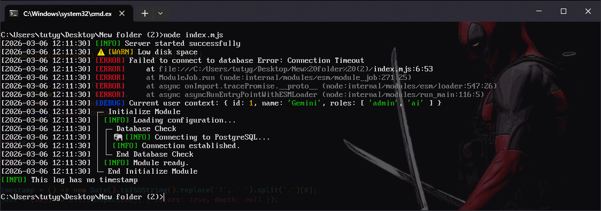
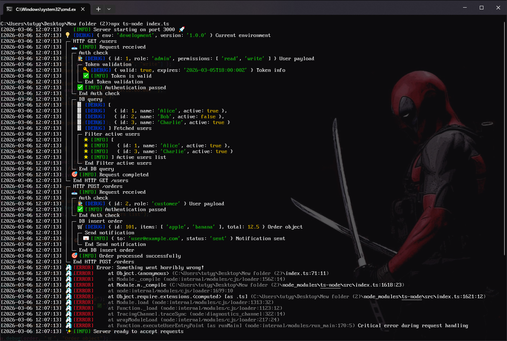

# logger-chroma

<p align="center"><a href="https://nodei.co/npm/logger-chroma/"></a></a></p>
<p align="center">
  
</p>

* 🎨 A lightweight, high-performance Node.js logging utility designed for developers who need to visualize complex, nested operations. `logger-chroma` transforms flat, messy console outputs into a beautiful, structured tree that makes debugging logical flows intuitive.
* 👨‍💻 Optimized for modern terminals like `Windows Terminal`, `VS Code Integrated Terminal`, `iTerm2`, and `Windows Git Bash Terminal` where box-drawing characters are rendered natively.
* ♻️ Works seamlessly with `CommonJS`, `ESM` and `TypeScript`

# 📦 Install via [NPM](https://www.npmjs.com/package/logger-chroma)

```bash
$ npm i logger-chroma
```

# 💻 Usage

- See examples below

## CommonJS (Random example)
```javascript
const loggerChroma = require('logger-chroma');

loggerChroma.info('Server started successfully');
loggerChroma.warn('Low disk space', '⚠️');
loggerChroma.error('Failed to connect to database', new Error('Connection Timeout'));

// --| Logging objects (automatically pretty-printed via util.inspect)
const user = { id: 1, name: 'Gemini', roles: ['admin', 'ai'] };
loggerChroma.debug('Current user context:', user);

// --| Using the grouping feature
loggerChroma.group('Initialize Module', () => {
    loggerChroma.info('Loading configuration...');

    // --| Nested Group
    loggerChroma.group('Database Check', () => {
        loggerChroma.info('Connecting to PostgreSQL...', '🐘');
        loggerChroma.info('Connection established.');
    });

    loggerChroma.info('Module ready.');
});

// --| Overriding config on the fly
loggerChroma.config.timestampEnabled = false;
loggerChroma.info('This log has no timestamp');
```

<p align="center">
  
</p>


## ESM or TypeScript (Random example)
```javascript
import loggerChroma from 'logger-chroma';

// --| Server start
loggerChroma.info("Server starting on port", 3000, "🚀");

// --| Environment info
loggerChroma.debug({ env: process.env.NODE_ENV || "development", version: "1.0.0" }, "💡", "Current environment");

// --| Full HTTP request handling example
loggerChroma.group("HTTP GET /users", () => {
    loggerChroma.info("Request received", "📥");

    // --| Authentication
    loggerChroma.group("Auth check", () => {
        const user = { id: 1, role: "admin", permissions: ["read", "write"] };
        loggerChroma.debug(user, "🕵️", "User payload");

        loggerChroma.group("Token validation", () => {
            const token = { valid: true, expires: "2026-03-05T18:00:00Z" };
            loggerChroma.debug(token, "🔑", "Token info");
            loggerChroma.info("Token is valid", "✅");
        });

        loggerChroma.info("Authentication passed", "✅");
    });

    // --| Database query
    loggerChroma.group("DB query", () => {
        const users = [
            { id: 1, name: "Alice", active: true },
            { id: 2, name: "Bob", active: false },
            { id: 3, name: "Charlie", active: true },
        ];
        loggerChroma.debug(users, "🗄️", "Fetched users");

        loggerChroma.group("Filter active users", () => {
            const activeUsers = users.filter(u => u.active);
            loggerChroma.info(activeUsers, "🌟", "Active users list");
        });
    });

    loggerChroma.info("Request completed", "🎯");
});

// --| Another route example
loggerChroma.group("HTTP POST /orders", () => {
    loggerChroma.info("Request received", "📥");

    loggerChroma.group("Auth check", () => {
        const user = { id: 2, role: "customer" };
        loggerChroma.debug(user, "🕵️", "User payload");
        loggerChroma.info("Authentication passed", "✅");
    });

    loggerChroma.group("DB insert order", () => {
        const order = { id: 101, items: ["apple", "banana"], total: 12.5 };
        loggerChroma.debug(order, "🛒", "Order object");

        loggerChroma.group("Send notification", () => {
            const notification = { to: "user@example.com", status: "sent" };
            loggerChroma.info(notification, "📧", "Notification sent");
        });
    });

    loggerChroma.info("Order processed successfully", "🎯");
});

// --| Error example
try {
    throw new Error("Something went horribly wrong!");
} catch (err) {
    loggerChroma.error(err, "🦄", "Critical error during request handling");
}

// --| Final server ready message
loggerChroma.info("Server ready to accept requests", "✨");
```
<p align="center">
  
</p>
